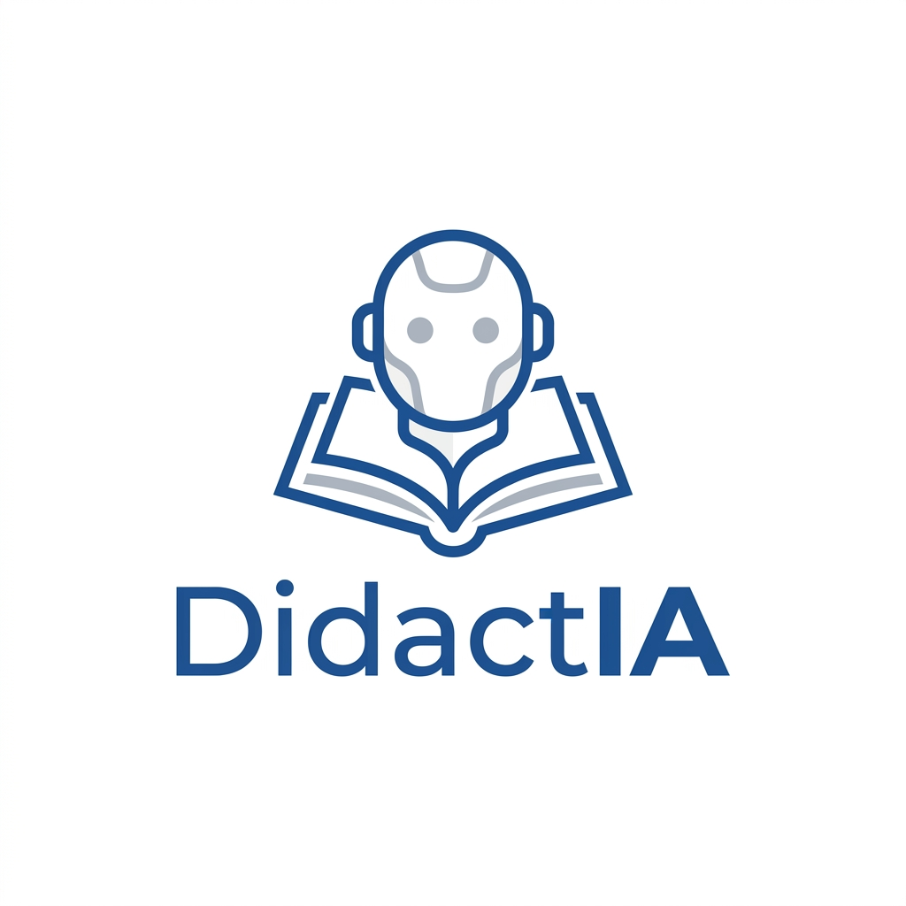

# DidactIA 🍎🤖
**El primer asistente de planeación didáctica hiper-alineado a la Nueva Escuela Mexicana.**

DidactIA es una aplicación inteligente diseñada exclusivamente para docentes de educación secundaria en México. Utiliza Inteligencia Artificial (Gemini 2.5) conectada **directamente** al documento oficial del **Programa Sintético (Fase 6)**, logrando crear secuencias didácticas completas, estructuradas y formalmente correctas en cuestión de segundos.

## 🌟 Características Principales

- **Conocimiento Oficial Integrado:** Toda la base de datos del *Plan Sintético* (Contenidos, PDAs y Ejes Articuladores) está integrada de manera nativa. La IA *no alucina*; extrae los propósitos reales y exactos publicados por la SEP.
- **Generación en 1-Clic:** Obtén tablas completas que incluyen: Metodología, Inicio, Desarrollo, Cierre, Instrumentos de Evaluación, Recursos y Observaciones; todo justificado de manera técnica e impecable.
- **Formato Oficial de Exportación (Word):** Las planeaciones generadas se pueden exportar instantáneamente a formato `.docx` con estructura de tablas, listas para editar, imprimir y firmar y entregar al área de coordinación.
- **Instalable (PWA):** No es solo una web. DidactIA está configurada como una *Progressive Web App* instalable. Puede fijarse en el escritorio de tu Mac/PC, o descargarse directamente en tu iPad / celuar Android/iPhone para funcionar a toda velocidad.
- **Autenticación Segura:** Sistema de usuarios protegido mediante la infraestructura de *Google Firebase Firebase*.

## 👨‍🏫 ¿Cómo se usa?

DidactIA está diseñada para pensar y platicar como un compañero de planeación maestro. Su uso consta de solo 3 pasos:

### 1️⃣ Inicia el chat con los datos base
Simplemente escribe en el chat lo que quieres enseñar. Por ejemplo:
> *"Hola, necesito una planeación de Formación Cívica para segundo grado. El tema es Los Fines de la Humanidad. Nos llevaremos 3 sesiones."*

### 2️⃣ Deja que la IA ensamble todo
Al detectar tu disciplina y el número de sesiones, la aplicación buscará en la base de datos el Contenido y el **PDA exacto** que emparejen con tu solicitud. Después, dosificará las actividades (Inicio, Desarrollo, Cierre) para llenar el número de sesiones que le pediste, todo usando metodologías activas (ABP, Proyectos Comunitarios, etc).

### 3️⃣ Platica o Descarga
La planeación aparecerá en pantalla. Si no te gusta algún detalle, simplemente dile: *"Por favor, cámbiale la actividad del día 2 porque mis alumnos no tienen internet"*. DidactIA lo rehará al instante adaptado a tu contexto.
Una vez que esté perfecta, haz clic en **Exportar a Word** y estará lista para entregarse en tu escuela.

## 🛠️ Tecnologías Utilizadas

- **Frontend:** HTML5, CSS3 y Vanilla JavaScript
- **Backend (Serverless):** Google Firebase (Auth / Firestore Storage)
- **IA Engine:** LLM Gemini Core / REST API de Google Generative AI
- **Generador de Documentos:** docx.js

---
*Desarrollado con pasión para facilitar la vida del cuerpo docente.* 
